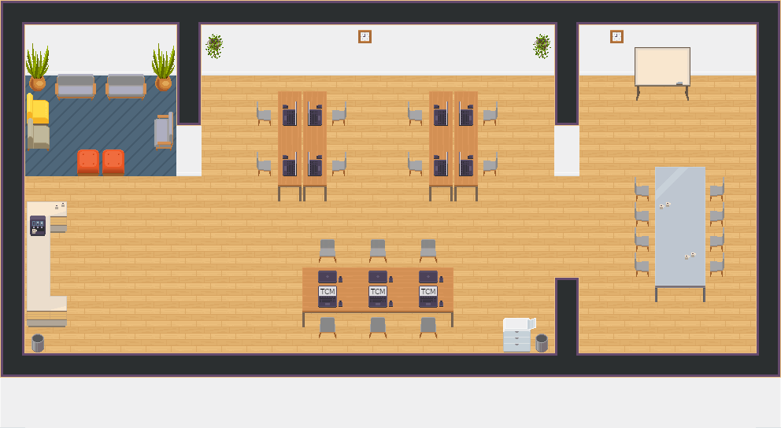

# WorkAdventure Map Starter Kit

This is a starter kit to help you build your own map for [WorkAdventure](https://workadventu.re).

To understand how to use this starter kit, follow the tutorial at [https://workadventu.re/map-building](https://workadventu.re/map-building).



## Use this map online

In https://workadventu.re/admin

- My Worlds
- Create a new world
- Give the world a name you like and click `Create`
- Create a new room
- Click on `Custom` tab
- Url of the custom map : `https://raw.githubusercontent.com/baldir-fr/workadventure-map-baldir-fr-main/master/map.json`
- Click `Select your custom map`

## Installation

With npm installed (comes with [node](https://nodejs.org/en/)), run the following commands into a terminal in the root directory of this project:

```shell
npm install
npm run start
```

The project will run at http://localhost:8080/

## Licenses

This project contains multiple licenses:

* [Code license](./LICENSE.code) *(all files except those for other licenses)*
* [Map license](./LICENSE.map) *(`map.json` and the map visual as well)*
* [Assets license](./LICENSE.assets) *(the files inside the `src/assets/` folder)*

### About third party assets

If you add third party assets in your map, do not forget to:
1. Credit the author and license with the "tilesetCopyright" property present in the properties of each tilesets in the `map.json` file
2. Add the license text in LICENSE.assets